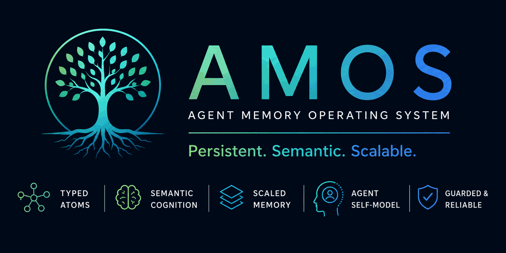
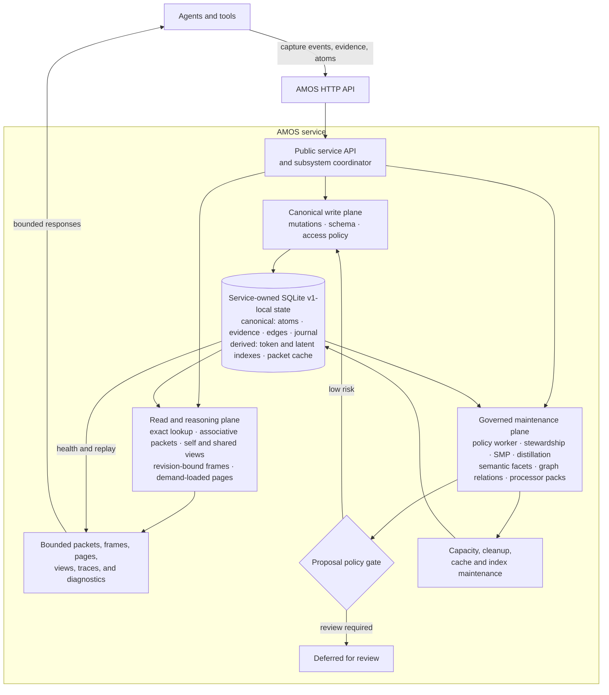

# AMOS

[](https://www.python.org/)
[](LICENSE)
[](tests)
[](#roadmap)
[](#current-status)

**A typed, auditable memory service for agents that need durable recall,
provenance, self-models, and deterministic maintenance instead of prompt-only
memory.**

**AMOS** stands for **Agent Memory Operating System**.

Amos is a model-neutral, layered, associative, self-maintaining memory substrate for agentic AI systems. It treats agent memory as an operating-system-like service: capture evidence, maintain typed memory, preserve provenance, perform cleanup, promote and demote memories across tiers, and render task-specific memory packets for reasoners, planners, executors, critics, and future processors.

The core thesis is that long-term agent memory should not be stored primarily as English summaries. English, embeddings, prompt snippets, and planner-specific payloads should be generated views over a canonical memory substrate composed of typed atoms, evidence links, associative edges, health states, and maintenance actions.

## Architecture



AMOS exposes memory as a service boundary. Agents submit structured evidence
and receive bounded packets; the service owns canonical state, journal replay,
maintenance policy, provenance, packet cache invalidation, and capacity
pressure reporting. Packet retrieval can include an attention context so AMOS
can foreground task-relevant memory, inhibit distracting material, reserve space
for counterevidence, and report the effective attention trace.

## Why Amos?

The agent-memory ecosystem is moving quickly. Projects such as
[Mem0](https://arxiv.org/abs/2504.19413), [Zep/Graphiti](https://arxiv.org/abs/2501.13956),
[Letta/MemGPT](https://arxiv.org/abs/2310.08560), and
[MemOS](https://arxiv.org/abs/2505.22101) have pushed long-term memory beyond
plain RAG and short conversation buffers.

AMOS is aimed at a narrower systems problem: making canonical agent memory
auditable, typed, replayable, and maintainable across a coordinated system of
agents.

| System | Typical center of gravity | Amos emphasis |
| --- | --- | --- |
| Mem0 | Production long-term memory extraction and retrieval for agents and apps. | Typed atoms, evidence links, journal replay, deterministic maintenance, and explicit packet contracts. |
| Zep / Graphiti | Temporal knowledge graph memory for conversational and enterprise context. | Service-owned canonical memory with lifecycle state, provenance, access policy, omissions, and capacity disclosure. |
| Letta / MemGPT | Stateful agent runtime and virtual context management. | Memory substrate that can sit below multiple agents, including reasoners, planners, critics, and domain processors. |
| MemOS | Research framing for memory as an operating-system resource across memory types. | A small Python implementation with concrete HTTP APIs, SQLite v1-local storage, schemas, tests, and maintenance workers. |

Use AMOS when you want:

- Canonical memory records instead of English-only summaries.
- A shared memory service for a coordinated group of agents.
- Per-agent self-models, capabilities, limitations, commitments, and runtime-state overlays.
- Retrieval packets that disclose provenance, omissions, conflicts, degradation, and scope filtering.
- Revision-bound coherent reasoning frames with demand-loaded pages instead of
  fixed independent memory slots.
- Producer-supplied `semantic_facets` and `graph_relations` that become
  provenance-bearing graph proposals under deterministic policy gates.
- Deterministic cleanup and distillation paths that do not require an LLM.
- Replayable state changes through an append-only event journal.

## Current status

This repository now includes a dependency-free AMOS v1-local implementation
alongside the design spec.

The public `Amos` class is the in-process service API and subsystem coordinator
for explicit access, mutation, indexing, graph, temporal, capacity, retrieval,
reasoning-frame, self-view, stewardship, policy, and diagnostic components.
Domain components depend on the store and named collaborators; they do not call
back into the public service object.

The first usable deployment profile is an AMOS HTTP service that owns one
in-process SQLite store and serializes access through the service boundary:

- Service-owned SQLite canonical store with an append-only event journal and
  checksum chain.
- Typed memory atoms, evidence records, associative edges, tombstones, packet cache,
  and retrieval outcomes.
- Rebuildable, content-only SQLite token candidate index with document-frequency
  weighting, complemented by an independent bounded latent candidate pool before
  deterministic in-Python ranking.
- Graph-versioned SMP vector model with dependency-free TF-IDF lexical hashing,
  hashed character 3/4-grams for morphology and typo tolerance, and a
  maintenance-built LSA token projection stored as disposable derived state.
- Schema validation for envelope/payload separation, typed payload contracts,
  JSON Schema property types, bounded canonical scores, and JSON-compatible
  atoms.
- Idempotent capture/commit operations and compare-and-swap update checks.
- Memory packets with scope isolation, access filtering, omissions, conflicts,
  provenance, and degradation metadata; normal retrieval omits superseded atoms
  unless the caller explicitly requests superseded history.
- Revision-bound reasoning frames and demand-loaded pages that budget coherent
  decision chains, commitment histories, episodes, conflicts, and governing
  constraints as units instead of independent atom slots.
- Attention-aware packet ranking with explicit focus, type-boost,
  counterevidence, and suppression score components plus packet-level
  `attention_trace` diagnostics.
- Retrieval-outcome feedback that journals packet-use telemetry and updates only
  atoms actually present in the identified packet, plus the association edges
  that brought used or corrected items into that packet.
- Self-awareness and agentic-recall views for self models, capabilities,
  limitations, runtime state, self-assessments, traces, outcomes, corrections,
  and blocked actions.
- Provenance-linked deterministic memory distillation.
- Automatic memory policy scheduling with a background HTTP-service worker for
  deterministic distillation, SMP, stewardship, processor-pack distillation,
  decay-policy execution, superseded-memory archiving, explicit proposal
  retention/deduplication, separate canonical/proposal quotas, storage cleanup,
  SQLite compaction, lexical/LSA derived-index refresh, and packet-cache
  invalidation.
- Deterministic non-generative Semantic Maintenance Processor (SMP) outputs
  using the required audit envelope.
- Generic maintenance proposal records, a processor registry, and a policy gate
  that auto-commits only low-risk derived atoms or active-endpoint edges while
  deferring review items.
- A generic maintenance processor registry. AMOS ships the built-in generic SMP
  adapter and canonical graph builder. Any producer can attach validated
  `semantic_facets` and `graph_relations` to typed atoms; AMOS builds governed
  edges without a domain processor. Domain-specific processors remain optional
  adapters for payloads that cannot emit the canonical contract directly.
- Processor-specific bounded worksets, hierarchical evidence coverage,
  explicit producer hints/cohorts, domain-owned distillation lanes,
  coherence-bounded automatic packets, edge derivation provenance, and graph,
  proposal-backlog, and per-processor effectiveness diagnostics.
- Advisory maintenance for deduplication and contradiction marking, with
  high-risk mutation requests gated behind explicit approval.
- Capacity pressure reporting and degraded packet disclosure.
- Idle-triggered storage cleanup that prunes archived/stale atoms from the hot
  token index, deletes expired archived/stale atoms through journaled
  tombstones, compacts old idempotency responses, checkpoints WAL, and runs
  SQLite `VACUUM` on a bounded interval.
- Journal chain and replay verification.
- An active background memory-policy worker plus in-process adapters for journal
  verification, index maintenance, packet-cache invalidation, capacity
  governance, stewardship, self-model calibration, agentic-recall auditing, and
  SMP analysis.
- Dependency-free HTTP adapter for the V1 JSON API surface; connected agents
  call the service instead of embedding their own stores. In HTTP service mode,
  memory health is observational and packet retrieval queues policy work on the
  background worker instead of running maintenance inline.
- CLI and tests.

Start here:

- [Amos Design Spec](docs/design-spec.md)
- [AMOS V1-Local Contract](docs/v1-local-contract.md)
- [Amos Developer Guide](docs/developer-guide.md)
- [AMOS V1 Verification Matrix](docs/v1-verification.md)
- [AMOS Roadmap](docs/roadmap.md)
- [Amos Mirror Agent Demo Spec](docs/mirror-agent-demo-spec.md)

## Quick start

Run the tests:

```bash
python -m pytest -q
```

Initialize a local store:

```bash
PYTHONPATH=src python -m amos.cli --db /tmp/amos.sqlite3 init
```

Commit and retrieve a memory atom:

```bash
PYTHONPATH=src python -m amos.cli --db /tmp/amos.sqlite3 commit-atom \
  --type belief \
  --payload '{"claim":"Codex outages should fall back to local advisors"}'

PYTHONPATH=src python -m amos.cli --db /tmp/amos.sqlite3 retrieve \
  --cue "Codex outage fallback"
```

Retrieve with an explicit attention context:

```bash
PYTHONPATH=src python -m amos.cli --db /tmp/amos.sqlite3 retrieve \
  --cue "training policy" \
  --attention-context '{"active_task":"performance search","focus_terms":["mission","routing"],"boost_memory_types":["policy"],"counterevidence_required":true}'
```

The returned packet includes `attention_trace` and item-level
`score_components` such as `attention_focus`, `attention_type_boost`,
`attention_counterevidence`, `attention_novelty`, and
`attention_suppression_penalty`. Retrieval without cues intentionally browses
visible memory by scope and attention context; cue and attention matching use
payload values rather than JSON field names to avoid schema-key false positives.
When cues or focus terms are present, v1-local unions document-frequency-weighted
lexical candidates with an independent bounded latent pool, then expands through
at most two graph hops before ranking. Suppression terms inhibit ranking only;
they never broaden the candidate pool.

Run the Amos Mirror Agent integration demo:

```bash
PYTHONPATH=src python examples/mirror_agent_demo.py --format text
```

Run the browser UI for conversational self-awareness and introspection:

```bash
PYTHONPATH=src python examples/mirror_agent_ui.py --host 127.0.0.1 --port 8787 --lm codex
```

The UI chat path uses local `codex exec` as the LM provider by default. AMOS
memory policy maintenance remains deterministic and non-LLM: SMP analysis,
stewardship, automatic distillation, index rebuilds, packet-cache invalidation,
and capacity reporting do not call the chat LM.

The demo exercises both the compatibility packet path and the current coherent
reasoning path. Its `Reasoning` view shows revision-bound resident units,
trusted demand-page descriptors, loaded pages, explicit unknowns/truncation,
and exact-ID lookup. The maintenance and graph views show producer-supplied
`semantic_facets`, explicit `graph_relations`, low-risk committed edges,
review-gated relations, proposal retention/deduplication, edge provenance, and
retrieval-feedback telemetry.

Serve the V1 HTTP API:

```bash
PYTHONPATH=src python -m amos.cli --db /tmp/amos.sqlite3 serve --host 127.0.0.1 --port 8765
```

The HTTP service starts a background memory-policy worker. `GET
/v1/health/memory` reports health and worker status without running maintenance
inline, while `POST /v1/atoms:get` resolves a known atom ID without semantic or
associative ranking and `POST /v1/packets:retrieve` performs associative recall.
Both retrieval paths queue a policy tick and return immediately. Explicit
`POST /v1/memory-policy:run` and the CLI
`memory-policy --run` command remain synchronous operator paths.

Historical reasoning integrations can call `POST
/v1/reasoning-frames:compile`, then load a descriptor returned in `page_index`
through `POST /v1/reasoning-pages:load`. Frames and pages expose a complete
serialized `token_estimate`, preserve trusted scope and access filtering, and
bind page descriptors to the exact `graph_version` and journal head. A changed
revision returns HTTP 409 with `code: "stale_revision"`; the caller recompiles
instead of combining memory states. Existing packet and exact-atom endpoints
remain compatible. Application mode selection and rollback stay in the Cogito
runtime, not in AMOS.

Reasoning-response budget fields use AMOS canonical JSON: compact separators,
sorted keys, UTF-8 bytes, and JSON escapes for non-ASCII characters. This makes
`budget.used_bytes` and `token_estimate` independently reproducible even when a
caller's repository-wide canonical serializer retains literal Unicode.
The response binds the full trusted request by digest instead of echoing its
free text and redundant runtime context. Its orientation echo is limited to
the identifiers and task fields useful for frame inspection.

Frame budgets also derive bounded candidate and graph-traversal work. Reaching
that allowance is reported as explicit truncation, with visible boundary
references retained in loadable page descriptors; it is not a fixed atom-count
output limit. Frame admission uses the same preservation-aware projection
ladder as page loading before falling back to descriptor-only context. A
compressed resident keeps its descriptor so the runtime can page in omitted
detail, and independently coherent descriptors remain eligible while budget
allows.

The trusted runtime may additionally provide `human_id`, `project_id`, and
`project_thread_id` (or `conversation_id`) in frame `task_context`. AMOS uses
only those validated fields for semantic isolation: untagged/global memory
remains eligible, while atoms explicitly tagged in their scope or payload for a
different human, project, or thread are excluded from frames and pages.

The stdlib HTTP adapter is the first single-process deployment profile: it owns
one SQLite store and serializes service calls for correctness. Reader/writer
parallelism with SQLite WAL or a production database adapter is the scale path
for heavier concurrent retrieval workloads.

Verify journal replay:

```bash
PYTHONPATH=src python -m amos.cli --db /tmp/amos.sqlite3 verify
```

Inspect or tune the automatic memory policy:

```bash
PYTHONPATH=src python -m amos.cli --db /tmp/amos.sqlite3 memory-policy
PYTHONPATH=src python -m amos.cli --db /tmp/amos.sqlite3 memory-policy --configure --schedule '{"every_graph_versions": 10, "every_seconds": 300}'
PYTHONPATH=src python -m amos.cli --db /tmp/amos.sqlite3 memory-policy --configure --decay '{"require_atom_policy":true,"max_atoms":256,"max_active_atoms":128,"max_proposed_atoms":128,"pressure_archive_policyless":true,"pressure_archive_proposed":true}'
PYTHONPATH=src python -m amos.cli --db /tmp/amos.sqlite3 memory-policy --configure --storage-cleanup '{"idle_after_seconds":300,"delete_archived_after_seconds":604800,"sqlite_compaction":{"vacuum_min_interval_seconds":86400}}'
PYTHONPATH=src python -m amos.cli --db /tmp/amos.sqlite3 memory-policy --run --force --trigger operator_check
PYTHONPATH=src python -m amos.cli --db /tmp/amos.sqlite3 maintenance-processors
PYTHONPATH=src python -m amos.cli --db /tmp/amos.sqlite3 maintenance-distiller --domain generic --processor-id amos.maintenance.generic.v1
```

Load an external maintenance processor pack from another package:

```bash
PYTHONPATH=src python -m amos.cli \
  --db /tmp/amos.sqlite3 \
  --maintenance-processor my_package.processors:training_flight_processor \
  maintenance-distiller \
  --domain training_flight \
  --processor-id my.training.flight.v1
```

Producers that already know their semantics can avoid a processor pack:

```json
{
  "id": "observed_outcome_2",
  "type": "semantic",
  "payload": {
    "summary": "A second supported observation.",
    "semantic_facets": [{
      "subject": "shared maintenance policy",
      "intent": "evaluate cleanup",
      "outcome": "supported",
      "outcome_direction": "positive",
      "time_index": 2
    }],
    "graph_relations": [{
      "source_ref": "$self",
      "target_ref": "observed_outcome_1",
      "relation": "rel:derived_from"
    }]
  }
}
```

Only active endpoints are materialized. Metadata on proposed atoms stays
dormant until lifecycle promotion; medium-risk explicit relations such as
causal claims remain deferred for review.

## Benchmark

AMOS includes a dependency-free local benchmark for the v1 SQLite service path:

```bash
python benchmarks/benchmark_amos.py --markdown --run-policy
```

The benchmark commits typed atoms carrying canonical `semantic_facets` and
`graph_relations`, measures exact lookup and paired cold/warm packet retrieval,
compiles coherent reasoning frames, loads demand pages, optionally runs the
automatic memory policy, and verifies the final replay state. Storage reports
the complete SQLite DB, WAL, and SHM footprint. It measures the current
in-process v1-local baseline, not HTTP, network, or background-worker scheduling
overhead.

Reference result from a local workstation run on 2026-07-23 with the forced
memory policy enabled. These values are single-run evidence for the 100-atom
v1-local profile, not an enforced performance gate:

| Benchmark | Result |
| --- | ---: |
| Atoms committed | 100 |
| Atoms with semantic facets / graph relations | 100 / 25 |
| Exact lookups | 20 (20 found) |
| Exact lookup latency p50 / p95 | 0.526 ms / 0.655 ms |
| Packet retrievals | 20 cold + 20 warm |
| Commit throughput | 385.31 atoms/s |
| Commit latency p50 / p95 | 2.467 ms / 3.254 ms |
| Cold packet latency p50 / p95 | 29.56 ms / 31.999 ms |
| Warm packet latency p50 / p95 | 0.362 ms / 0.422 ms |
| Average packet items | 6.15 |
| Reasoning frame compiles | 5 at 1600 tokens |
| Reasoning frame latency p50 / p95 | 407.979 ms / 435.047 ms |
| Average resident units / page descriptors | 0.8 / 1.4 |
| Demand-page loads | 5 at 1800 tokens |
| Demand-page latency p50 / p95 | 3.42 ms / 3.808 ms |
| Forced memory policy run | 21102.086 ms (completed) |
| Maintenance proposals / committed / deferred | 112 / 87 / 25 |
| Replay verification after policy | 31.934 ms (ok) |
| Edges before policy / final | 72 / 147 |
| Final atoms / edges | 101 / 147 |
| SQLite DB / WAL / SHM / total footprint | 1744896 / 399672 / 32768 / 2177336 bytes |
| Environment | Python 3.12.2; 24 CPUs; Linux-7.0.0-28-generic-x86_64-with-glibc2.39 |

## Integration boundary

AMOS owns canonical memory, recall, provenance, cleanup metadata, self-awareness
views, and advisory maintenance. It does not directly execute external actions.
Integrations such as the Mirror Agent demo should keep live control authority,
validation, approval checks, and runtime packet application outside AMOS.
Domain-specific maintenance packs should follow the same boundary: they inspect
bounded AMOS evidence windows and return side-effect-free proposals; optional
`window_request` metadata narrows lifecycle/type/profile and evidence needs but
cannot widen scope or budgets. The AMOS service applies policy gates, journals
accepted low-risk mutations, records edge derivation, and defers ambiguous or
high-risk work for review.

### Agent identity and cognitive-processor boundary

AMOS preserves the identity and continuity of an agent, not the identity of the
model used to process a request. Integrations must keep these concepts separate:

- `agent_id` names the durable agent or digital being whose self-model,
  autobiography, commitments, and memories are represented in AMOS.
- `processor_id` and `target_processor` name functional processing roles for an
  invocation. The LLM provider, model, checkpoint, weights, quantization, prompt,
  and runtime are replaceable processing-substrate metadata, not agent identity.
- A language-model invocation may receive bounded context and use ephemeral
  caches, but it is stateless with respect to durable identity, memory authority,
  commitments, and cross-session continuity. Those remain in AMOS and the
  integrating runtime.
- First-person language is a delegated rendering of the active agent's voice. It
  must be grounded in that agent's current self-awareness packet and must not
  present the model provider, training persona, or model traits as the agent's
  self.
- Prior model output is fallible generated expression, not canonical memory or
  independent evidence. Model-derived memories and self-model changes must enter
  AMOS as provenance-bearing, evidence-linked proposals and pass the normal
  validation, authorization, and lifecycle gates.

Replacing a model is a processor-substrate migration. It may change capability
or runtime observations, but it must not silently change `agent_id`, rewrite the
agent's lineage, or promote the incoming model's identity into the self-model.

### Client integration lessons

AMOS works best when clients treat it as a shared memory plane, not a prompt
log. A coordinated agent system should run one logical AMOS instance, give each
durable agent a stable identity, give reasoner, planner, executor, and other
processing roles separate processor identifiers, and retrieve bounded packets
for the current agent, task, scope, processor role, and runtime state.

Recommended integration pattern:

- Store raw experiences as evidence-backed traces, outcomes, corrections, and
  retrieval outcomes.
- Use client-owned maintenance processor packs to promote repeated experiences
  into compact capability, limitation, semantic, or procedure atoms.
- Keep static role contracts, current runtime state, and learned experience
  profile atoms separate in prompt rendering.
- Treat retrieved memories as advisory context. Application control registries,
  permissions, schemas, and safety guardrails remain hard authority.
- Record whether retrieved memories were materially used. Retrieved-but-uncited
  context should be neutral telemetry, not positive reinforcement.
- Treat HTTP `503` responses with `"retryable": true` as transient service
  failures. Retry with bounded exponential backoff and jitter, and use a stable
  idempotency key before retrying a write.
- Render concise operational digests for agents and retain full packets in
  telemetry for audit.

This keeps AMOS generic while allowing client systems to learn domain-specific
behavior from their own traces.

## Design goals

- Reduce long-term storage and token cost.
- Avoid repeated expensive full-memory redistillation.
- Preserve provenance and auditability.
- Support reasoners, planners, executors, critics, and future non-LLM processors.
- Model memory as dynamic: layered, associative, promotable, demotable, and self-maintaining.
- Treat memory maintenance as a first-class internal system responsibility.

## Roadmap

Planned work is maintained separately in [docs/roadmap.md](docs/roadmap.md) so
future architecture is not presented as current v1-local behavior.

## Non-goals for this phase

- No vendor-specific vector database commitment.
- No prompt-only memory architecture.
- No autonomous external-state procedure execution.
- No irreversible autonomous deletion policy without audit controls.
- No canonical graph snapshots or compacted journal segments yet; replay uses
  the full retained journal.
- No v1-local ownership of evidence-object deletion, encryption keys, snapshots,
  or offline-backup enforcement.
- No per-tier capacity accounting or production-scale latency guarantee; the
  current capacity mode covers one SQLite file and the benchmark is evidence,
  not an acceptance threshold.
- No bundled production Postgres service yet; Postgres DDL is included as the
  target migration contract, while v1-local uses SQLite behind the HTTP API.
