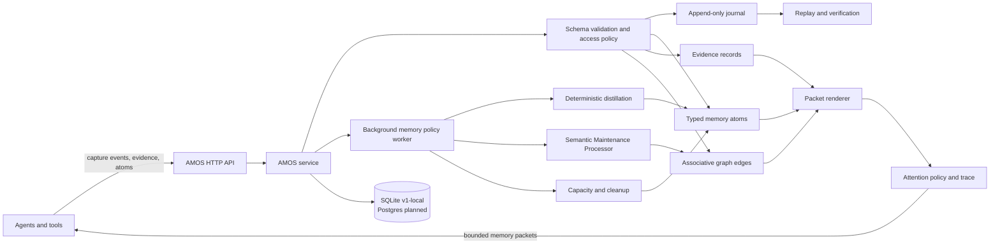

# Amos

[](https://www.python.org/)
[](LICENSE)
[](tests)
[](#roadmap)
[](#current-status)

**A typed, auditable memory service for agents that need durable recall,
provenance, self-models, and deterministic maintenance instead of prompt-only
memory.**

**Amos** stands for **Agent Memory Operating System**.

Amos is a model-neutral, layered, associative, self-maintaining memory substrate for agentic AI systems. It treats agent memory as an operating-system-like service: capture evidence, maintain typed memory, preserve provenance, perform cleanup, promote and demote memories across tiers, and render task-specific memory packets for reasoners, planners, executors, critics, and future processors.

The core thesis is that long-term agent memory should not be stored primarily as English summaries. English, embeddings, prompt snippets, and planner-specific payloads should be generated views over a canonical memory substrate composed of typed atoms, evidence links, associative edges, health states, and maintenance actions.

## Architecture



AMOS exposes memory as a service boundary. Agents submit structured evidence
and receive bounded packets; the service owns canonical state, journal replay,
maintenance policy, provenance, packet cache invalidation, and capacity
pressure reporting. Packet retrieval can include an attention context so AMOS
can foreground task-relevant memory, inhibit distracting material, reserve space
for counterevidence, and report the effective attention trace.

## Why Amos?

The agent-memory ecosystem is moving quickly. Projects such as
[Mem0](https://arxiv.org/abs/2504.19413), [Zep/Graphiti](https://arxiv.org/abs/2501.13956),
[Letta/MemGPT](https://arxiv.org/abs/2310.08560), and
[MemOS](https://arxiv.org/abs/2505.22101) have pushed long-term memory beyond
plain RAG and short conversation buffers.

AMOS is aimed at a narrower systems problem: making canonical agent memory
auditable, typed, replayable, and maintainable across a coordinated system of
agents.

| System | Typical center of gravity | Amos emphasis |
| --- | --- | --- |
| Mem0 | Production long-term memory extraction and retrieval for agents and apps. | Typed atoms, evidence links, journal replay, deterministic maintenance, and explicit packet contracts. |
| Zep / Graphiti | Temporal knowledge graph memory for conversational and enterprise context. | Service-owned canonical memory with lifecycle state, provenance, access policy, omissions, and capacity disclosure. |
| Letta / MemGPT | Stateful agent runtime and virtual context management. | Memory substrate that can sit below multiple agents, including reasoners, planners, critics, and domain processors. |
| MemOS | Research framing for memory as an operating-system resource across memory types. | A small Python implementation with concrete HTTP APIs, SQLite v1-local storage, schemas, tests, and maintenance workers. |

Use AMOS when you want:

- Canonical memory records instead of English-only summaries.
- A shared memory service for a coordinated group of agents.
- Per-agent self-models, capabilities, limitations, commitments, and runtime-state overlays.
- Retrieval packets that disclose provenance, omissions, conflicts, degradation, and scope filtering.
- Deterministic cleanup and distillation paths that do not require an LLM.
- Replayable state changes through an append-only event journal.

## Current status

This repository now includes a dependency-free AMOS v1-local implementation
alongside the design spec.

The first usable deployment profile is an AMOS HTTP service that owns one
in-process SQLite store and serializes access through the service boundary:

- Service-owned SQLite canonical store with an append-only event journal and
  checksum chain.
- Typed memory atoms, evidence records, associative edges, tombstones, packet cache,
  and retrieval outcomes.
- Rebuildable SQLite token candidate index used to prefilter cue/attention
  retrieval before deterministic in-Python ranking.
- Schema validation for envelope/payload separation, typed payload contracts,
  and JSON-compatible atoms.
- Idempotent capture/commit operations and compare-and-swap update checks.
- Memory packets with scope isolation, access filtering, omissions, conflicts,
  provenance, and degradation metadata.
- Attention-aware packet ranking with explicit focus, type-boost,
  counterevidence, and suppression score components plus packet-level
  `attention_trace` diagnostics.
- Retrieval-outcome feedback that journals packet-use telemetry and updates
  referenced atom utility, salience, access time, and low-utility health.
- Self-awareness and agentic-recall views for self models, capabilities,
  limitations, runtime state, self-assessments, traces, outcomes, corrections,
  and blocked actions.
- Provenance-linked deterministic memory distillation.
- Automatic memory policy scheduling with a background HTTP-service worker for
  deterministic distillation, SMP, stewardship, processor-pack distillation,
  decay-policy execution, storage cleanup, SQLite compaction, derived-index
  refresh, and packet-cache invalidation.
- Deterministic non-generative Semantic Maintenance Processor (SMP) outputs
  using the required audit envelope.
- Generic maintenance proposal records, a processor registry, and a policy gate
  that auto-commits only low-risk derived atoms while deferring review items.
- A generic maintenance processor registry. AMOS ships the built-in generic SMP
  adapter; domain-specific processors are loaded from client packages with
  explicit import paths.
- Advisory maintenance for deduplication and contradiction marking, with
  high-risk mutation requests gated behind explicit approval.
- Capacity pressure reporting and degraded packet disclosure.
- Idle-triggered storage cleanup that prunes archived/stale atoms from the hot
  token index, deletes expired archived/stale atoms through journaled
  tombstones, compacts old idempotency responses, checkpoints WAL, and runs
  SQLite `VACUUM` on a bounded interval.
- Journal chain and replay verification.
- Worker artifacts for background memory policy ticks, projection checks, index
  maintenance, packet-cache invalidation, capacity governance, stewardship,
  self-model calibration, agentic-recall auditing, and SMP analysis.
- Dependency-free HTTP adapter for the V1 JSON API surface; connected agents
  call the service instead of embedding their own stores. In HTTP service mode,
  memory health is observational and packet retrieval queues policy work on the
  background worker instead of running maintenance inline.
- CLI and tests.

Start here:

- [Amos Design Spec](docs/design-spec.md)
- [Amos Developer Guide](docs/developer-guide.md)
- [AMOS V1 Verification Matrix](docs/v1-verification.md)
- [Amos Mirror Agent Demo Spec](docs/mirror-agent-demo-spec.md)

## Quick start

Run the tests:

```bash
python -m pytest -q
```

Initialize a local store:

```bash
PYTHONPATH=src python -m amos.cli --db /tmp/amos.sqlite3 init
```

Commit and retrieve a memory atom:

```bash
PYTHONPATH=src python -m amos.cli --db /tmp/amos.sqlite3 commit-atom \
  --type belief \
  --payload '{"claim":"Codex outages should fall back to local advisors"}'

PYTHONPATH=src python -m amos.cli --db /tmp/amos.sqlite3 retrieve \
  --cue "Codex outage fallback"
```

Retrieve with an explicit attention context:

```bash
PYTHONPATH=src python -m amos.cli --db /tmp/amos.sqlite3 retrieve \
  --cue "training policy" \
  --attention-context '{"active_task":"performance search","focus_terms":["mission","routing"],"boost_memory_types":["policy"],"counterevidence_required":true}'
```

The returned packet includes `attention_trace` and item-level
`score_components` such as `attention_focus`, `attention_type_boost`,
`attention_counterevidence`, `attention_novelty`, and
`attention_suppression_penalty`. Retrieval without cues intentionally browses
visible memory by scope and attention context; cue and attention matching use
payload values rather than JSON field names to avoid schema-key false positives.
When cues or attention terms are present, v1-local uses a SQLite token index to
prefilter candidate atoms and then expands to graph neighbors before ranking.

Run the Amos Mirror Agent integration demo:

```bash
PYTHONPATH=src python examples/mirror_agent_demo.py --format text
```

Run the browser UI for conversational self-awareness and introspection:

```bash
PYTHONPATH=src python examples/mirror_agent_ui.py --host 127.0.0.1 --port 8787 --lm codex
```

The UI chat path uses local `codex exec` as the LM provider by default. AMOS
memory policy maintenance remains deterministic and non-LLM: SMP analysis,
stewardship, automatic distillation, index rebuilds, packet-cache invalidation,
and capacity reporting do not call the chat LM.

Serve the V1 HTTP API:

```bash
PYTHONPATH=src python -m amos.cli --db /tmp/amos.sqlite3 serve --host 127.0.0.1 --port 8765
```

The HTTP service starts a background memory-policy worker. `GET
/v1/health/memory` reports health and worker status without running maintenance
inline, while `POST /v1/packets:retrieve` queues a policy tick and returns the
packet immediately. Explicit `POST /v1/memory-policy:run` and the CLI
`memory-policy --run` command remain synchronous operator paths.

Verify journal replay:

```bash
PYTHONPATH=src python -m amos.cli --db /tmp/amos.sqlite3 verify
```

Inspect or tune the automatic memory policy:

```bash
PYTHONPATH=src python -m amos.cli --db /tmp/amos.sqlite3 memory-policy
PYTHONPATH=src python -m amos.cli --db /tmp/amos.sqlite3 memory-policy --configure --schedule '{"every_graph_versions": 10, "every_seconds": 300}'
PYTHONPATH=src python -m amos.cli --db /tmp/amos.sqlite3 memory-policy --configure --decay '{"require_atom_policy":true,"max_atoms":256}'
PYTHONPATH=src python -m amos.cli --db /tmp/amos.sqlite3 memory-policy --configure --storage-cleanup '{"idle_after_seconds":300,"delete_archived_after_seconds":604800,"sqlite_compaction":{"vacuum_min_interval_seconds":86400}}'
PYTHONPATH=src python -m amos.cli --db /tmp/amos.sqlite3 memory-policy --run --force --trigger operator_check
PYTHONPATH=src python -m amos.cli --db /tmp/amos.sqlite3 maintenance-processors
PYTHONPATH=src python -m amos.cli --db /tmp/amos.sqlite3 maintenance-distiller --domain generic --processor-id amos.maintenance.generic.v1
```

Load an external maintenance processor pack from another package:

```bash
PYTHONPATH=src python -m amos.cli \
  --db /tmp/amos.sqlite3 \
  --maintenance-processor my_package.processors:training_flight_processor \
  maintenance-distiller \
  --domain training_flight \
  --processor-id my.training.flight.v1
```

## Benchmark

AMOS includes a dependency-free local benchmark for the v1 SQLite service path:

```bash
python benchmarks/benchmark_amos.py --markdown --run-policy
```

The benchmark commits typed atoms through the in-process service API, retrieves
planner packets, verifies replay, and optionally runs the automatic memory
policy once. It measures the current v1-local SQLite baseline, not HTTP,
network, or background-worker scheduling overhead.

Reference result from a local workstation run on 2026-07-04:

| Benchmark | Result |
| --- | ---: |
| Atoms committed | 100 |
| Retrievals | 20 |
| Commit throughput | 1120.0 atoms/s |
| Commit latency p50 / p95 | 0.841 ms / 1.024 ms |
| Retrieval latency p50 / p95 | 0.243 ms / 15.1 ms |
| Average packet items | 9 |
| Replay verification | 20.036 ms (ok) |
| Forced memory policy run | 195.668 ms (completed) |
| Final atoms / edges | 101 / 60 |
| SQLite DB size | 1126400 bytes |
| Environment | Python 3.12.2; 24 CPUs; Linux-6.17.0-35-generic-x86_64-with-glibc2.39 |

## Integration boundary

AMOS owns canonical memory, recall, provenance, cleanup metadata, self-awareness
views, and advisory maintenance. It does not directly execute external actions.
Integrations such as the Mirror Agent demo should keep live control authority,
validation, approval checks, and runtime packet application outside AMOS.
Domain-specific maintenance packs should follow the same boundary: they inspect
bounded AMOS evidence windows and return side-effect-free proposals; the AMOS
service applies policy gates, journals accepted low-risk mutations, and defers
ambiguous or high-risk work for review.

## Design goals

- Reduce long-term storage and token cost.
- Avoid repeated expensive full-memory redistillation.
- Preserve provenance and auditability.
- Support reasoners, planners, executors, critics, and future non-LLM processors.
- Model memory as dynamic: layered, associative, promotable, demotable, and self-maintaining.
- Treat memory maintenance as a first-class internal system responsibility.

## Roadmap

### v1.0

- Stabilize the V1 HTTP API envelopes and schema contracts.
- Keep SQLite as the first supported shared-service deployment profile.
- Expand replay verification and background-maintenance acceptance tests.
- Improve attention policy diagnostics, packet-ranking diagnostics, omissions
  reporting, and retrieval-outcome utility learning.
- Harden the Mirror Agent demo as the reference self-awareness integration.

### Storage and Scale

- Add production Postgres support using the existing migration contract.
- Add optional vector and full-text index integrations while keeping index data
  rebuildable and non-canonical.
- Support larger multi-tenant deployments with clearer capacity budgets, pressure modes, and retention policy controls.
- Add export/import tooling for moving v1-local SQLite stores into production deployments.

### Memory Quality

- Broaden deterministic SMP coverage for deduplication, contradiction detection, stale-memory demotion, and graph repair.
- Add more domain-processor examples for task-specific distillation without changing AMOS core.
- Improve self-model calibration reports and agentic-recall audits.
- Add governance surfaces for reviewing deferred or high-risk maintenance proposals.

### Ecosystem

- Publish package artifacts when the API stabilizes.
- Add GitHub Actions CI badges once repository CI is configured.
- Document integration adapters for agent runtimes and orchestration frameworks.
- Provide deployment recipes for local service, containerized service, and hosted Postgres-backed service profiles.

## Non-goals for this phase

- No vendor-specific vector database commitment.
- No prompt-only memory architecture.
- No autonomous external-state procedure execution.
- No irreversible autonomous deletion policy without audit controls.
- No bundled production Postgres service yet; Postgres DDL is included as the
  target migration contract, while v1-local uses SQLite behind the HTTP API.
