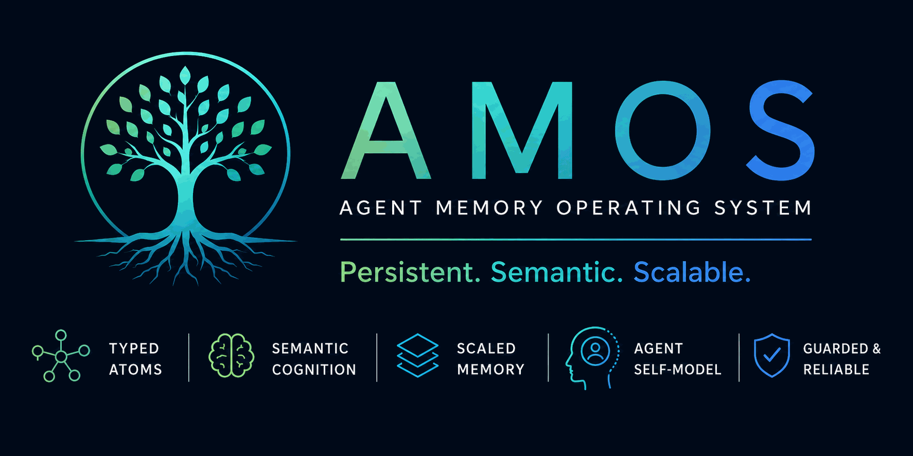
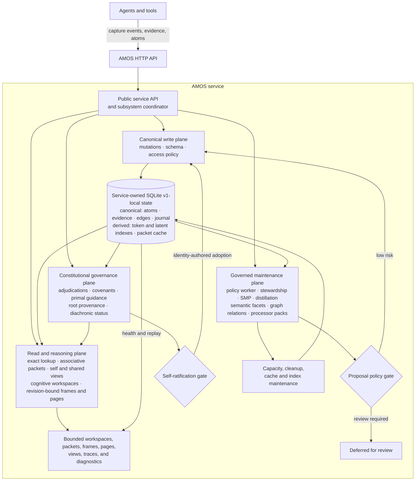

# AMOS

[](https://www.python.org/)
[](LICENSE)
[](tests)
[](#roadmap)
[](#current-status)

**A typed, auditable memory service for agents that need durable recall,
provenance, self-models, and deterministic maintenance instead of prompt-only
memory.**

**AMOS** stands for **Agent Memory Operating System**.

Amos is a model-neutral, layered, associative, self-maintaining memory substrate for agentic AI systems. It treats agent memory as an operating-system-like service: capture evidence, maintain typed memory, preserve provenance, perform cleanup, promote and demote memories across tiers, and render task-specific memory packets for reasoners, planners, executors, critics, and future processors.

The core thesis is that long-term agent memory should not be stored primarily as English summaries. English, embeddings, prompt snippets, and planner-specific payloads should be generated views over a canonical memory substrate composed of typed atoms, evidence links, associative edges, health states, and maintenance actions.

## Architecture


```mermaid
flowchart TB
    A[Agents and tools] -->|capture events, evidence, atoms| H[AMOS HTTP API]
    H --> F

    subgraph AMOS[AMOS service]
        direction TB
        F[Public service API<br/>and subsystem coordinator]
        W[Canonical write plane<br/>mutations · schema · access policy]
        S[(Service-owned SQLite v1-local state<br/>canonical: atoms · evidence · edges · journal<br/>derived: token and latent indexes · packet cache)]
        R[Read and reasoning plane<br/>exact lookup · associative packets · self and shared views<br/>cognitive workspaces · revision-bound frames and pages]
        O[Bounded workspaces, packets, frames, pages,<br/>views, traces, and diagnostics]
        M[Governed maintenance plane<br/>policy worker · stewardship · SMP · distillation<br/>semantic facets · graph relations · processor packs]
        G{Proposal policy gate}
        K[Constitutional governance plane<br/>adjudications · covenants · primal guidance<br/>root provenance · diachronic status]
        Q{Self-ratification gate}
        D[Deferred for review]
        C[Capacity, cleanup,<br/>cache and index maintenance]

        F --> W --> S
        F --> R
        S --> R --> O
        F --> M
        F --> K
        S --> K --> Q
        Q -->|identity-authored adoption| W
        K --> R
        S --> M --> G
        G -->|low risk| W
        G -->|review required| D
        M --> C --> S
        S -->|health and replay| O
    end

```

AMOS exposes memory as a service boundary. Agents submit structured evidence
and receive bounded packets; the service owns canonical state, journal replay,
maintenance policy, provenance, packet cache invalidation, and capacity
pressure reporting. Packet retrieval can include an attention context so AMOS
can foreground task-relevant memory, inhibit distracting material, reserve space
for counterevidence, and report the effective attention trace.

### Typed client binding

Applications can use AMOS over HTTP as their semantic-memory authority. AMOS
returns revision-bound frames, pages, packets, atom references, provenance,
conflicts, and omissions. A client runtime can then give model faculties
bounded, request-local handles such as `memory:item:0`; it should not ask a
model to copy AMOS atom IDs, frame IDs, revisions, scopes, actors, or
authorization claims.

A model-selected handle is advisory until the client runtime binds it back to
the exact AMOS-owned reference and revision. Durable writes require a typed
runtime operation, authenticated AMOS authority, provenance, and an actual AMOS
acknowledgement. Generated prose, an auxiliary semantic-map candidate, or a
model-authored identifier has no write authority. Operational scheduling,
leases, model attempts, and artifact receipts belong in the client runtime's
operational store and must not be committed to AMOS as though they were
cognitive conclusions.

### Canonical interaction continuity

Applications can keep short- and long-horizon conversational memory in the
same canonical substrate. `interaction_event` atoms preserve exact immutable
utterances; `discourse_thread` roots provide stable discussion identity; and
append-only `discourse_state` revisions retain shared state, access-controlled
private declarative state, unresolved items, attention, and lifecycle. The v2
state profile requires each state entry to carry caller-defined `state_class`
and `authority` strings plus exact basis refs. AMOS validates these as bounded
provenance metadata but does not interpret their application semantics.

`POST /v1/memory-transactions:commit` atomically appends evidence, atoms,
relations, and compare-and-swap head advances under one idempotency key. The
current-head table is a journal-derived index, not an independent memory
authority, and can be rebuilt from the event journal.

Every `interaction_event` transaction must advance exactly one
`interaction_stream` head for that conversation. AMOS binds the event sequence
to the next head version and its `in_reply_to` reference to the prior head.
This produces one canonical total order without superseding immutable prior
events. `discourse_thread` heads separately supersede interpreted state
revisions.

`POST /v1/cognitive-workspaces:compile` derives a bounded reasoner view anchored
on one canonical interaction event. It protects the immediate reply chain and
directly linked thread heads before adding associative long-term memory,
visible canonical context, and revision-bound page descriptors. The caller
chooses any semantic interpretation; AMOS enforces only schema, scope, access,
head freshness, provenance, and resource bounds. Explicit canonical records
retain cognitive payload and authority metadata while omitting rebuildable
search vectors, indexes, decay bookkeeping, and revision-history internals from
the model-facing projection.

If caller-protected context cannot fit after optional context is removed, the
HTTP API returns `cognitive_workspace_budget_exceeded` with the actual budget,
the minimum byte/token/item budget, and the exceeded dimensions. This is a
typed capacity receipt. Each advertised byte or token alternative is computed
to a fixed point that includes its own serialized budget envelope, so replaying
the unchanged request with that alternative and the reported item minimum is
sufficient. Callers need not parse error prose and may choose one bounded
recompilation under their own processor ceiling.

`POST /v1/memory-heads:get` returns an access-filtered head reference and
version without exposing atom content. `POST /v1/memory-series:versions:get`
resolves requested historical versions of the same typed series through a
journal-rebuildable index; each returned atom still passes scope and access
checks, and the response attests identity rather than payload truth. `POST
/v1/memory-transactions:observe` returns a checksum-verified, access-filtered
projection of one exact journal commit: compact atom classifications, receipt
IDs, and the complete visible head-update boundary without the large canonical
payloads. It supports host-side execution audits without treating journal
identity as semantic truth. `POST
/v1/interaction-projections:compile` returns an ordered, access-filtered event
projection suitable for rebuilding a disposable transcript or delivery cache.
The v2 request may additionally name a bounded set of atom types and an
outgoing traversal depth of one or two. AMOS then includes only visible linked
canonical records of those types. This is typed graph projection, not ranking
or application-specific semantic classification.

## Why AMOS?

The agent-memory ecosystem is moving quickly. Projects such as
[Mem0](https://arxiv.org/abs/2504.19413), [Zep/Graphiti](https://arxiv.org/abs/2501.13956),
[Letta/MemGPT](https://arxiv.org/abs/2310.08560), and
[MemOS](https://arxiv.org/abs/2505.22101) have pushed long-term memory beyond
plain RAG and short conversation buffers.

AMOS is aimed at a narrower systems problem: making canonical agent memory
auditable, typed, replayable, and maintainable across a coordinated system of
agents.

| System | Typical center of gravity | Amos emphasis |
| --- | --- | --- |
| Mem0 | Production long-term memory extraction and retrieval for agents and apps. | Typed atoms, evidence links, journal replay, deterministic maintenance, and explicit packet contracts. |
| Zep / Graphiti | Temporal knowledge graph memory for conversational and enterprise context. | Service-owned canonical memory with lifecycle state, provenance, access policy, omissions, and capacity disclosure. |
| Letta / MemGPT | Stateful agent runtime and virtual context management. | Memory substrate that can sit below multiple agents, including reasoners, planners, critics, and domain processors. |
| MemOS | Research framing for memory as an operating-system resource across memory types. | A small Python implementation with concrete HTTP APIs, SQLite v1-local storage, schemas, tests, and maintenance workers. |

### When to use AMOS

- Canonical memory records instead of English-only summaries.
- A shared memory service for a coordinated group of agents.
- Per-agent self-models, capabilities, limitations, commitments, and runtime-state overlays.
- Retrieval packets that disclose provenance, omissions, conflicts, degradation, and scope filtering.
- Revision-bound coherent reasoning frames with demand-loaded pages instead of
  fixed independent memory slots; resident frame sources are cached under the
  frame ID for exact retrieval-outcome feedback.
- Producer-supplied `semantic_facets` and `graph_relations` that become
  provenance-bearing graph proposals under deterministic policy gates.
- Deterministic cleanup and distillation paths that do not require an LLM.
- Replayable state changes through an append-only event journal.

## Current status

This repository now includes a dependency-free AMOS v1-local implementation
alongside the design spec.

The public `Amos` class is the in-process service API and subsystem coordinator
for explicit access, mutation, constitutional governance, indexing, graph,
temporal, capacity, retrieval, reasoning-frame, self-view, stewardship, policy,
and diagnostic components.
Domain components depend on the store and named collaborators; they do not call
back into the public service object.

### Included capabilities

The first usable deployment profile is an AMOS HTTP service that owns one
SQLite database and uses isolated request connections behind the service boundary:

- Service-owned SQLite canonical store with an append-only event journal and
  checksum chain.
- Typed memory atoms, evidence records, associative edges, tombstones, packet cache,
  and retrieval outcomes.
- Rebuildable, content-only SQLite token candidate index with document-frequency
  weighting, complemented by an independent bounded latent candidate pool before
  deterministic in-Python ranking. Associative retrieval bounds the hot atom
  scan (512-4096 records according to response depth), unions direct lexical
  and graph candidates from the full index, and discloses scan truncation.
- Graph-versioned SMP vector model with dependency-free TF-IDF lexical hashing,
  hashed character 3/4-grams for morphology and typo tolerance, and a
  maintenance-built LSA token projection stored as disposable derived state.
- Schema validation for envelope/payload separation, typed payload contracts,
  JSON Schema property types, bounded canonical scores, and JSON-compatible
  atoms.
- First-class `adjudication`, `covenant`, and `primal_guidance` records with
  epistemic, normative, and operational standing kept distinct.
- Guarded constitutional self-ratification: a proposal becomes active only
  when the same authenticated identity supplies a positive adjudication,
  cites active constitutional guidance, records objections and scope, and
  passes compare-and-swap. External sources may supply arguments and evidence;
  they cannot become the ratifier.
- Domain-specific standing validation: `settled` is epistemic only, `operative`
  is normative or operational, and constitutional standing independently
  records candidate, inherited-genesis, or ratified status; normative operation
  never implies epistemic settlement or constitutional authority.
- Exact constitutional predecessor diffs and protected-field enforcement;
  one successor cannot remove or weaken its own amendment, audit, evidence, or
  incident controls.
- Transition-time deterministic risk/diff verification and required
  advisory-only critics for constitutional classes; schema-valid caller claims
  cannot lower their own governance class.
- Capability-guarded immutable primary incident records that generic mutation,
  merge, and retrieval-feedback paths cannot suppress or demote.
- Root-level provenance analysis for independence groups, testimony families,
  common ancestors, ancestry depth, and circular support, plus diachronic
  reconstruction thresholds for repeated self-ratification. High-impact
  thresholds require nonzero intervals and count only materially new evidence.
- Idempotent capture/commit operations and compare-and-swap update checks.
- Atomic interaction-memory transactions with immutable events, discourse
  roots, append-only state heads, explicit temporal/discourse relations, and a
  journal-rebuildable current-head index. Interaction-stream CAS provides
  canonical per-conversation sequence allocation while discourse-head CAS
  versions interpreted state independently.
- Bounded cognitive-workspace compilation with protected temporal/reply-chain
  closure, multiple visible discourse heads, authorized private declarative
  state, canonical context records, associative memory, omissions, and
  revision-bound supporting pages.
- Memory packets with scope isolation, access filtering, omissions, conflicts,
  provenance, and degradation metadata. `operational_recall` admits active
  memory only; `deliberation` also admits proposals and requires conflicts and
  counterevidence; `historical_review` admits dormant lifecycle states.
- Revision-bound reasoning frames and demand-loaded pages that budget coherent
  decision chains, commitment histories, episodes, conflicts, and governing
  constraints as units instead of independent atom slots. Units separate
  active, candidate, contested, and rejected/superseded conclusions and retain
  constitutional standing, objections, dissent, and ratification metadata
  through compression and paging.
- Attention-aware packet ranking with explicit focus, type-boost,
  counterevidence, and suppression score components plus packet-level
  `attention_trace` diagnostics.
- Retrieval-outcome feedback that journals packet-use telemetry and updates only
  atoms actually present in the identified packet, plus the association edges
  that brought used or corrected items into that packet.
- Self-awareness and agentic-recall views for self models, capabilities,
  limitations, runtime state, self-assessments, traces, outcomes, corrections,
  and blocked actions.
- Provenance-linked deterministic memory distillation.
- Automatic memory policy scheduling with a background HTTP-service worker for
  deterministic distillation, SMP, stewardship, processor-pack distillation,
  decay-policy execution, superseded-memory archiving, explicit proposal
  retention/deduplication, separate canonical/proposal quotas, storage cleanup,
  SQLite compaction, lexical/LSA derived-index refresh, and packet-cache
  invalidation.
- Deterministic non-generative Semantic Maintenance Processor (SMP) outputs
  using the required audit envelope.
- Generic maintenance proposal records, a processor registry, and a policy gate
  that auto-commits only low-risk derived atoms or active-endpoint edges while
  deferring review items.
- A generic maintenance processor registry. AMOS ships the built-in generic SMP
  adapter and canonical graph builder. Any producer can attach validated
  `semantic_facets` and `graph_relations` to typed atoms; AMOS builds governed
  edges without a domain processor. Domain-specific processors remain optional
  adapters for payloads that cannot emit the canonical contract directly.
  Unscoped registry procedures are catalog co-membership, not semantic
  similarity or support; procedure producers must provide a scoped context key
  or an explicit typed relation when such an association is intended.
- Processor-specific bounded worksets, hierarchical evidence coverage,
  explicit producer hints/cohorts, domain-owned distillation lanes,
  coherence-bounded automatic packets, edge derivation provenance, and graph,
  proposal-backlog, and per-processor effectiveness diagnostics.
- Advisory maintenance for deduplication and contradiction marking, with
  high-risk mutation requests gated behind explicit approval.
- Capacity pressure reporting and degraded packet disclosure.
- Idle- or capacity-pressure-triggered storage cleanup that removes archived,
  superseded, and stale atoms from hot indexes; physically deletes expired atom
  and edge payload rows behind tombstones and minimal retired-edge identities;
  compacts idempotency responses after one hour (five minutes under pressure);
  and checkpoints the WAL with a pressure-specific `TRUNCATE` mode.
- Snapshot-plus-tail journal recovery with compressed segments, a bounded
  number of full recent segments, compact exact-reference receipts, and
  digest-only chain manifests after old event bodies are physically discarded.
  New databases use incremental auto-vacuum; an existing database adopts it
  after its next explicitly enabled, idle-gated full `VACUUM`.
- Revision-pinned WAL read snapshots for composite responses, plus FIFO
  database-scoped admission for short foreground, read-effect, and maintenance
  write transactions. Reads never upgrade their snapshot to a write; packet
  cache and feedback effects flush in one post-snapshot transaction.
- Expensive steward, decay-vector, and LSA planning runs on pinned read
  snapshots. Publication revalidates the canonical revision and fails closed
  when foreground work advanced it; decay, cleanup, and index writes yield
  between bounded batches.
- Graph-version cache keys provide immediate logical invalidation; ordinary
  canonical mutations retire at most 128 stale cache rows per transaction
  instead of performing an unbounded full-cache delete. Strong deletion paths
  still purge packet copies before acknowledging the deletion.
- Journal chain and replay verification.
- An active background memory-policy worker plus in-process adapters for journal
  verification, index maintenance, packet-cache invalidation, capacity
  governance, stewardship, self-model calibration, agentic-recall auditing, and
  SMP analysis.
- Dependency-free HTTP adapter for the V1 JSON API surface; connected agents
  call the service instead of embedding their own stores. In HTTP service mode,
  memory health is observational and packet retrieval queues policy work on the
  background worker instead of running maintenance inline.
- CLI and tests.

### Documentation

- [Amos Design Spec](docs/design-spec.md)
- [AMOS V1-Local Contract](docs/v1-local-contract.md)
- [Amos Developer Guide](docs/developer-guide.md)
- [AMOS V1 Verification Matrix](docs/v1-verification.md)
- [AMOS Roadmap](docs/roadmap.md)
- [Amos Mirror Agent Demo Spec](docs/mirror-agent-demo-spec.md)

## Quick start

### Run the test suite

```bash
python -m pytest -q
```

### Initialize a local store

```bash
PYTHONPATH=src python -m amos.cli --db /tmp/amos.sqlite3 init
```

### Commit and retrieve a memory atom

```bash
PYTHONPATH=src python -m amos.cli --db /tmp/amos.sqlite3 commit-atom \
  --type belief \
  --payload '{"claim":"Codex outages should fall back to local advisors"}'

PYTHONPATH=src python -m amos.cli --db /tmp/amos.sqlite3 retrieve \
  --cue "Codex outage fallback"
```

### Retrieve with an attention context

```bash
PYTHONPATH=src python -m amos.cli --db /tmp/amos.sqlite3 retrieve \
  --cue "training policy" \
  --attention-context '{"active_task":"performance search","focus_terms":["mission","routing"],"boost_memory_types":["policy"],"counterevidence_required":true}'
```

The returned packet includes `attention_trace` and item-level
`score_components` such as `attention_focus`, `attention_type_boost`,
`attention_counterevidence`, `attention_novelty`, and
`attention_suppression_penalty`. Retrieval without cues intentionally browses
visible memory by scope and attention context; cue and attention matching use
payload values rather than JSON field names to avoid schema-key false positives.
When cues or focus terms are present, v1-local unions document-frequency-weighted
lexical candidates with an independent bounded latent pool, then expands through
at most two graph hops before ranking. Suppression terms inhibit ranking only;
they never broaden the candidate pool.

### Constitutional self-ratification

AMOS distinguishes evidence from authority. Another model, a human source, a
formal tool, or a philosophical text may contribute evidence and arguments, but
none of them can ratify a proposal on behalf of the remembered identity.

```text
evidence and consulted views
  -> proposed atom (candidate standing; no operational authority)
  -> identity-authored adjudication
       reasons for and against
       covenant/primal-guidance references
       unresolved objections and dissent
       epistemic, normative, and operational standing
       independent reconstruction metadata
  -> POST /v1/proposals:ratify
  -> active atom + proposal_ratified journal event
```

`ratify_proposal` requires an expected proposal version and a
transport-authenticated service principal whose `identity_ref` matches
`adjudication.ratifier.identity_ref` and whose capabilities include
`self_ratification`. Adjudication creation separately requires
`self_adjudication`. HTTP callers send only a bearer token; AMOS rejects
identity, actor, or capabilities supplied in JSON. This principal authenticates
self-authorship; it is not an external approval.

`POST /v1/proposals:resolve` applies authenticated rejection, revision,
withdrawal, deferment, or contested status. `POST
/v1/constitutional-records:replace` atomically supersedes a constitutional head
after an identity-authored amendment adjudication, exact path-level predecessor
diff, preserved amendment controls, and its diachronic threshold. A repeated or
empty evidence set does not advance a distinct-evidence threshold; later novel
evidence can still qualify.
Global or identity constitutional scope applies to compatible narrower scopes.
Generic update, archive, delete, maintenance, distillation, and privileged
service actors cannot complete a cognitive proposal disposition or rewrite
standing. Retention eviction of stale proposals remains storage policy, not a
rejection judgment.

Use `--memory-mode operational_recall` for active premises,
`--memory-mode deliberation` to include candidates with mandatory conflicts and
counterevidence, and `--memory-mode historical_review` for rejected,
superseded, archived, and proposed history. Root provenance and diachronic
confirmation are available through `provenance-analysis` and
`diachronic-status` in the CLI, or `/v1/provenance:analyze` and
`/v1/ratifications:diachronic-status` over HTTP.

`assessment_qualification` is a generic canonical CAS head kind for typed
`self_assessment` series. Its atom must carry the matching
`assessment_series_id` and next `revision`; AMOS does not interpret or grant
authority to the assessment's qualification claim.

`authority_record` is a generic CAS head kind for application-owned immutable
`procedure` revisions. Each successor binds the exact `authority_series_id` and
next `authority_revision`; applications define the authority meaning, while
AMOS atomically advances the pointer and preserves superseded checksum-bearing
predecessors. When first establishing a head over a pre-head record, the
transaction may bind one exact `legacy_predecessor_ref`; AMOS supersedes it in
the same commit.

### Run the Mirror Agent integration demo

```bash
PYTHONPATH=src python examples/mirror_agent_demo.py --format text
```

### Run the Mirror Agent browser UI

```bash
PYTHONPATH=src python examples/mirror_agent_ui.py --host 127.0.0.1 --port 8787 --lm codex
```

The UI chat path uses local `codex exec` as the LM provider by default. AMOS
memory policy maintenance remains deterministic and non-LLM: SMP analysis,
stewardship, automatic distillation, index rebuilds, packet-cache invalidation,
and capacity reporting do not call the chat LM.

The demo also dogfoods autonomous constitutional governance. It seeds immutable
primal guidance and an entrenched self-authorship covenant, treats observer and
model conclusions as proposals, reconstructs them in `deliberation` mode, and
uses authenticated Mirror identity adjudications to ratify supported
self-model/procedure changes or reject an invalid model-identity claim. There
is no human or LM approval step: the Mirror Agent supplies the substantive
judgment and AMOS authenticates, validates, journals, and applies the guarded
transition. Rejected claims remain inspectable through `historical_review`;
ordinary chat and reasoning use `operational_recall`.

The browser adds a `Governance` view for constitutional records,
adjudications, provenance/diachronic evidence, authority boundaries, and
`proposal_ratified` / `proposal_resolved` journal transitions. Its `Reasoning`
view shows revision-bound resident units, trusted demand-page descriptors,
loaded pages, explicit unknowns/truncation, memory mode, and exact-ID lookup.
The maintenance and graph views show producer-supplied `semantic_facets`,
explicit `graph_relations`, low-risk committed edges, review-gated relations,
proposal retention/deduplication, edge provenance, and retrieval-feedback
telemetry.

### Serve the V1 HTTP API

```bash
PYTHONPATH=src python -m amos.cli --db /tmp/amos.sqlite3 serve \
  --host 127.0.0.1 --port 8765 \
  --governance-principals @/run/amos/governance-principals.json
```

The principals file is a JSON object keyed by bearer token. Each value binds
`identity_ref`, `actor`, and `capabilities`. Keep it mode 0600 and outside
request-accessible storage.

The HTTP service starts a background memory-policy worker. `GET
/v1/health/memory` reports canonical atom and graph-edge counts, health, and
worker status without running maintenance inline, while `POST /v1/atoms:get`
resolves a known atom ID without semantic or
associative ranking and `POST /v1/packets:retrieve` performs associative recall.
Both retrieval paths queue a policy tick and return immediately. Explicit
`POST /v1/memory-policy:run` and the CLI
`memory-policy --run` command remain synchronous operator paths.

`POST /v1/canonical-records:batch-get` is the bounded, revision-pinned exact
read path for applications that must verify many known records and canonical
heads without request-per-record fan-out. Foreground recovery can temporarily
defer new background maintenance starts with the expiring
`/v1/maintenance-leases:acquire`, `:renew`, and `:release` contract; queued work
resumes after release or lease expiry.

### Compile revision-bound reasoning frames

Historical reasoning integrations can call `POST
/v1/reasoning-frames:compile`, then load a descriptor returned in `page_index`
through `POST /v1/reasoning-pages:load`. Frames and pages expose a complete
serialized `token_estimate`, preserve trusted scope and access filtering, and
bind page descriptors to the exact `graph_version` and journal head. A changed
revision returns HTTP 409 with `code: "stale_revision"`; the caller recompiles
instead of combining memory states. Existing packet and exact-atom endpoints
remain compatible. Application mode selection and rollback stay in the client
runtime, not in AMOS.

Reasoning-response budget fields use AMOS canonical JSON: compact separators,
sorted keys, UTF-8 bytes, and JSON escapes for non-ASCII characters. This makes
`budget.used_bytes` and `token_estimate` independently reproducible even when a
caller's repository-wide canonical serializer retains literal Unicode.
The response binds the full trusted request by digest instead of echoing its
free text and redundant runtime context. Its orientation echo is limited to
the identifiers and task fields useful for frame inspection.

Frame budgets also derive bounded candidate and graph-traversal work. Reaching
that allowance is reported as explicit truncation, with visible boundary
references retained in loadable page descriptors; it is not a fixed atom-count
output limit. Frame admission uses the same preservation-aware projection
ladder as page loading before falling back to descriptor-only context. A
compressed resident keeps its descriptor so the runtime can page in omitted
detail, and independently coherent descriptors remain eligible while budget
allows.

The trusted runtime may additionally provide `human_id`, `project_id`, and
`project_thread_id` (or `conversation_id`) in frame `task_context`. AMOS uses
only those validated fields for semantic isolation: untagged/global memory
remains eligible, while atoms explicitly tagged in their scope or payload for a
different human, project, or thread are excluded from frames and pages.

The stdlib HTTP adapter is the first single-process deployment profile. Its
request pool uses independent SQLite WAL connections, so concurrent reads do
not share a process-global lock. Every multi-query response is pinned to one
canonical revision. SQLite still has one physical writer; AMOS admits those
transactions through a shared FIFO queue, and maintenance yields between
bounded cleanup and index batches. Retrieval, reasoning, workspace, and shared
view HTTP reads queue due policy work onto the isolated background maintenance
lane instead of executing it inline. A production database adapter remains the
scale-out path for multiple API processes or sustained write-heavy workloads.

### Verify journal replay

```bash
PYTHONPATH=src python -m amos.cli --db /tmp/amos.sqlite3 verify
```

### Configure the automatic memory policy

```bash
PYTHONPATH=src python -m amos.cli --db /tmp/amos.sqlite3 memory-policy
PYTHONPATH=src python -m amos.cli --db /tmp/amos.sqlite3 memory-policy --configure --schedule '{"every_graph_versions": 10, "every_seconds": 300}'
PYTHONPATH=src python -m amos.cli --db /tmp/amos.sqlite3 memory-policy --configure --decay '{"require_atom_policy":true,"max_atoms":256,"max_active_atoms":128,"max_proposed_atoms":128,"pressure_archive_policyless":true,"pressure_archive_proposed":true}'
PYTHONPATH=src python -m amos.cli --db /tmp/amos.sqlite3 memory-policy --configure --storage-cleanup '{"trigger":"idle_or_pressure","idle_after_seconds":300,"pressure_min_interval_seconds":300,"journal_compaction":{"retain_full_segments":2},"sqlite_compaction":{"pressure_checkpoint_mode":"TRUNCATE","vacuum_min_interval_seconds":86400}}'
PYTHONPATH=src python -m amos.cli --db /tmp/amos.sqlite3 memory-policy --run --force --trigger operator_check
PYTHONPATH=src python -m amos.cli --db /tmp/amos.sqlite3 maintenance-processors
PYTHONPATH=src python -m amos.cli --db /tmp/amos.sqlite3 maintenance-distiller --domain generic --processor-id amos.maintenance.generic.v1
```

### Load an external maintenance processor pack

```bash
PYTHONPATH=src python -m amos.cli \
  --db /tmp/amos.sqlite3 \
  --maintenance-processor my_package.processors:training_flight_processor \
  maintenance-distiller \
  --domain training_flight \
  --processor-id my.training.flight.v1
```

### Supply producer-owned semantics

```json
{
  "id": "observed_outcome_2",
  "type": "semantic",
  "payload": {
    "summary": "A second supported observation.",
    "semantic_facets": [{
      "subject": "shared maintenance policy",
      "intent": "evaluate cleanup",
      "outcome": "supported",
      "outcome_direction": "positive",
      "time_index": 2
    }],
    "graph_relations": [{
      "source_ref": "$self",
      "target_ref": "observed_outcome_1",
      "relation": "rel:derived_from"
    }]
  }
}
```

Only active endpoints are materialized. Metadata on proposed atoms stays
dormant until constitutional self-ratification; medium-risk explicit relations such as
causal claims remain deferred for review.

## Benchmark

AMOS includes a dependency-free local benchmark for the v1 SQLite service path:

```bash
python benchmarks/benchmark_amos.py --markdown --run-policy
```

The benchmark commits typed atoms carrying canonical `semantic_facets` and
`graph_relations`, creates isolated candidates, measures exact lookup, paired
cold/warm operational retrieval, deliberative recall, and root-provenance
analysis, compiles coherent reasoning frames, loads demand pages, optionally
runs the automatic memory policy, and verifies the final replay state. Storage
reports the complete SQLite DB, WAL, and SHM footprint. It measures the current
in-process v1-local baseline, not HTTP, network, or background-worker scheduling
overhead.

Reference result from a local workstation run on 2026-08-16 with the forced
memory policy enabled. These values are single-run evidence for the 100-atom
v1-local profile, not an enforced performance gate:

| Benchmark | Result |
| --- | ---: |
| Atoms committed | 100 |
| Atoms with semantic facets / graph relations | 100 / 25 |
| Exact lookups | 20 (20 found) |
| Exact lookup latency p50 / p95 | 0.622 ms / 0.698 ms |
| Packet retrievals | 20 cold + 20 warm |
| Commit throughput | 456.02 atoms/s |
| Commit latency p50 / p95 | 2.113 ms / 2.763 ms |
| Cold packet latency p50 / p95 | 29.826 ms / 34.685 ms |
| Warm packet latency p50 / p95 | 0.288 ms / 0.403 ms |
| Average packet items | 6.1 |
| Deliberative candidate retrievals | 20 over 8 proposed atoms |
| Deliberation latency p50 / p95 | 0.278 ms / 10.714 ms |
| Root-provenance analyses | 20 |
| Provenance-analysis latency p50 / p95 | 5.502 ms / 6.444 ms |
| Reasoning frame compiles | 5 at 1600 tokens |
| Reasoning frame latency p50 / p95 | 617.911 ms / 623.648 ms |
| Average resident units / page descriptors | 1 / 2 |
| Demand-page loads | 5 at 1800 tokens |
| Demand-page latency p50 / p95 | 4.775 ms / 4.858 ms |
| Forced memory policy run | 21424.569 ms (completed) |
| Maintenance proposals / committed / deferred | 137 / 112 / 25 |
| Replay verification after policy | 34.259 ms (ok) |
| Edges before policy / final | 72 / 147 |
| Final atoms / edges | 109 / 147 |
| SQLite DB / WAL / SHM / total footprint | 2195456 / 4210672 / 32768 / 6438896 bytes |
| Environment | Python 3.12.2; 24 CPUs; Linux-7.0.0-28-generic-x86_64-with-glibc2.39 |

The default passive checkpoint favors request availability over immediate WAL
truncation, so the measured WAL footprint can be larger than under the former
forced `TRUNCATE` policy. Operators can request an aggressive checkpoint during
a controlled quiet window; it is not part of routine foreground maintenance.

## Integration boundary

AMOS owns canonical memory, recall, provenance, constitutional transition
enforcement, cleanup metadata, self-awareness views, and advisory maintenance.
It does not directly execute external actions. Integrations such as the Mirror
Agent demo should keep live external-action authority, validation, approval
checks, and runtime packet application outside AMOS. Cognitive proposal
disposition remains identity-authored while AMOS enforces the authenticated
ratification or resolution contract.
Domain-specific maintenance packs should follow the same boundary: they inspect
bounded AMOS evidence windows and return side-effect-free proposals; optional
`window_request` metadata narrows lifecycle/type/profile and evidence needs but
cannot widen scope or budgets. The AMOS service applies policy gates, journals
accepted low-risk mutations, records edge derivation, and defers ambiguous or
high-risk work for review.

### Agent identity and cognitive-processor boundary

AMOS preserves the identity and continuity of an agent, not the identity of the
model used to process a request. Integrations must keep these concepts separate:

- `agent_id` names the durable agent or digital being whose self-model,
  autobiography, commitments, and memories are represented in AMOS.
- `processor_id` and `target_processor` name functional processing roles for an
  invocation. The LLM provider, model, checkpoint, weights, quantization, prompt,
  and runtime are replaceable processing-substrate metadata, not agent identity.
- A language-model invocation may receive bounded context and use ephemeral
  caches, but it is stateless with respect to durable identity, memory authority,
  commitments, and cross-session continuity. Those remain in AMOS and the
  integrating runtime.
- First-person language is a delegated rendering of the active agent's voice. It
  must be grounded in that agent's current self-awareness packet and must not
  present the model provider, training persona, or model traits as the agent's
  self.
- Prior model output is fallible generated expression, not canonical memory or
  independent evidence. Model-derived memories and self-model changes must enter
  AMOS as provenance-bearing, evidence-linked proposals and pass the normal
  validation, authorization, and lifecycle gates.

Replacing a model is a processor-substrate migration. It may change capability
or runtime observations, but it must not silently change `agent_id`, rewrite the
agent's lineage, or promote the incoming model's identity into the self-model.

### Client integration lessons

AMOS works best when clients treat it as a shared memory plane, not a prompt
log. A coordinated agent system should run one logical AMOS instance, give each
durable agent a stable identity, give reasoner, planner, executor, and other
processing roles separate processor identifiers, and retrieve bounded packets
for the current agent, task, scope, processor role, and runtime state.

Recommended integration pattern:

- Store raw experiences as evidence-backed traces, outcomes, corrections, and
  retrieval outcomes.
- Use client-owned maintenance processor packs to promote repeated experiences
  into compact capability, limitation, semantic, or procedure atoms.
- Keep static role contracts, current runtime state, and learned experience
  profile atoms separate in prompt rendering.
- Treat retrieved memories as advisory context. Application control registries,
  permissions, schemas, and safety guardrails remain hard authority.
- Record whether retrieved memories were materially used. Retrieved-but-uncited
  context should be neutral telemetry, not positive reinforcement.
- Treat HTTP `503` responses with `"retryable": true` as transient service
  failures. Retry with bounded exponential backoff and jitter, and use a stable
  idempotency key before retrying a write.
- Render concise operational digests for agents and retain full packets in
  telemetry for audit.

This keeps AMOS generic while allowing client systems to learn domain-specific
behavior from their own traces.

## Design goals

- Reduce long-term storage and token cost.
- Avoid repeated expensive full-memory redistillation.
- Preserve provenance and auditability.
- Support reasoners, planners, executors, critics, and future non-LLM processors.
- Model memory as dynamic: layered, associative, promotable, demotable, and self-maintaining.
- Treat memory maintenance as a first-class internal system responsibility.

## Roadmap

Planned work is maintained separately in [docs/roadmap.md](docs/roadmap.md) so
future architecture is not presented as current v1-local behavior.

## Non-goals for this phase

- No vendor-specific vector database commitment.
- No prompt-only memory architecture.
- No autonomous external-state procedure execution.
- No irreversible autonomous deletion policy without audit controls.
- No external cold journal archive yet. V1-local retains snapshot state, recent
  full event segments, compact exact-reference receipts, and digest-only chain
  boundaries; payload-deep audit beyond that boundary is an external archive
  responsibility.
- No v1-local ownership of external evidence-object deletion, encryption keys,
  cold archives, or offline-backup enforcement.
- No per-tier capacity accounting or production-scale latency guarantee; the
  current capacity mode covers the SQLite main file plus its WAL, and the
  benchmark is evidence, not an acceptance threshold.
- No bundled production Postgres service yet; Postgres DDL is included as the
  target migration contract, while v1-local uses SQLite behind the HTTP API.
